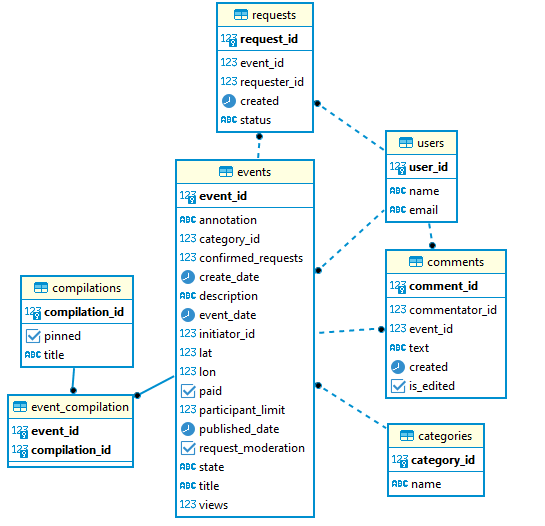

# Проект Explore With Me

---
Технологии: Java 11, Spring Boot 2.7.2, PostgreSQL, H2, Maven, Docker, Hibernate, Lombok.

## Описание

Бэкенд для приложения-афиши, где можно предложить какое-либо событие от выставки до похода в кино и набрать компанию
для участия в нём.

### Проект состоит из 2 микросервисов:

1. Основной сервис: содержит всё необходимое для работы продукта, запускается на порту 8080, имеет свою базу данных.

API основного сервиса делится на три части:

- Публичная, доступна без регистрации любому пользователю сети. Пользователи могут просматривать события, комментарии к
  опубликованным событиям, подборки событий и категории событий.
- Закрытая, доступна только авторизованным пользователям. Позвояет пользователям добавлять новые события, изменять
  их или отменять; оставлять, обновлять или удалять свои комментарии к событиям; оставлять запросы на участие в
  событиях; подтверждать или отклонять запросы других участников на участие в собственных событиях.
- Административная, для администраторов сервиса. Позволяет администратору редактировать, публиковать или отклонять
  события пользователей; редактировать или удалять комментарии к событиям; добавлять, изменять или удалять категории
  событий; добавлять или удалять пользователей; добавлять или удалять подборки событий; закреплять и откреплять
  подборки на главной странице.

[Подробная спецификация API основного сервиса](https://github.com/Roman-Anikin/java-explore-with-me/blob/main/ewm-main-service-spec.json)
(требуется Swagger редактор)

Модель базы данных основного сервиса

---

2. Сервис статистики: собирает информацию о количестве обращений пользователей к спискам событий и о количестве запросов
   к подробной информации о событии, запускается на порту 9090, имеет свою базу данных.

[Подробная спецификация API сервиса статистики](https://github.com/Roman-Anikin/java-explore-with-me/blob/main/ewm-stats-service-spec.json)
(требуется Swagger редактор)

Модель базы данных сервиса статистики

## Запуск приложения

---

### С помощью командной строки

Необходимые инструменты:

* [Java (JDK) 11;](https://docs.aws.amazon.com/corretto/latest/corretto-11-ug/downloads-list.html)
* [Apache Maven 4.x](https://maven.apache.org/users/index.html)

Находясь в корневой папке проекта, выполнить:

* mvn package
* java -jar main/target/explore-with-me-main-0.0.1-SNAPSHOT.jar
* java -jar stat/target/explore-with-me-stat-0.0.1-SNAPSHOT.jar

### С помощью Docker

Необходимые инструменты:

* [Java (JDK) 11;](https://docs.aws.amazon.com/corretto/latest/corretto-11-ug/downloads-list.html)
* [Apache Maven 4.x](https://maven.apache.org/users/index.html)
* [Docker](https://www.docker.com/)

Находясь в корневой папке проекта, запустить Docker и выполнить:

* docker-compose up